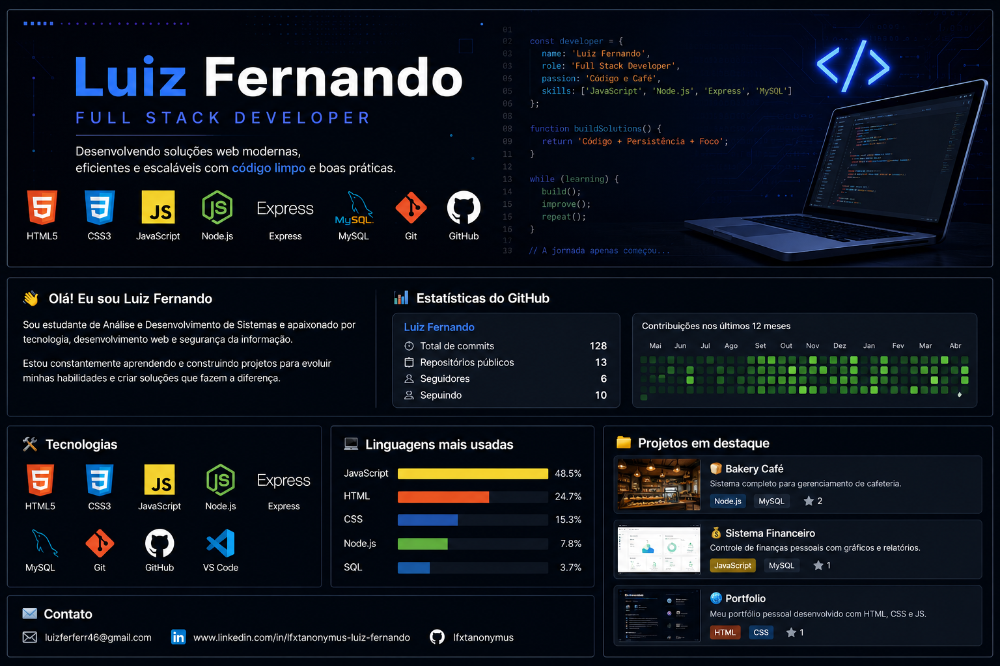

  

<h1 align="center">Olá! Eu sou Luiz Fernando 👋</h1>

<h3 align="center">
Desenvolvedor Full Stack | Node.js | JavaScript | MySQL
</h3>

  

## 📊 Estatísticas

  
  

<h1 align="center">Olá! Eu sou Luiz Fernando 👋</h1>

<h3 align="center">
Desenvolvedor Full Stack | Node.js | JavaScript | MySQL
</h3>

🎓 Formado em Análise e Desenvolvimento de Sistemas

🚀 Apaixonado por Desenvolvimento Web e Segurança da Informação

🎯 Em busca da primeira oportunidade como Desenvolvedor.
---
## 🚀 Tecnologias

- 🌐 HTML5
- 🎨 CSS3
- ⚡ JavaScript
- 🟢 Node.js
- 🚀 Express
- 🗄️ MySQL
- 🔀 Git
- 🐙 GitHub
- 💻 VS Code

---

## 📚 Atualmente estudando

- APIs REST
- Banco de Dados
- Segurança da Informação
- Desenvolvimento Full Stack

---

## Projeto em destaque

## 🍞 Bakery Café

Sistema Full Stack desenvolvido com:

- HTML
- CSS
- JavaScript
- Node.js
- Express
- MySQL

### Funcionalidades

✅ Cadastro de produtos

✅ Cadastro de pedidos

✅ Rastreamento por telefone

✅ Avaliações

✅ API REST

🔗 Repositório:
https://github.com/Lfxtanonymus/bakery-cafe

## 📫 Contato

📧 luizferferr46@gmail.com

💼 LinkedIn

www.linkedin.com/in/lfxtanonymus-luiz-fernando

🐙 GitHub

https://github.com/Lfxtanonymus

📍 Espírito Santo - Brasil
